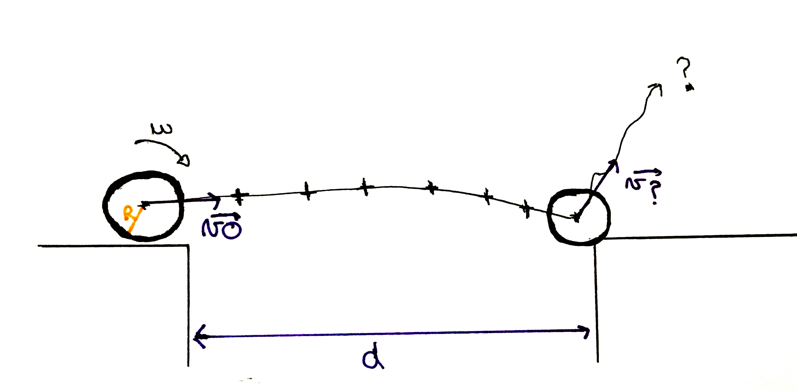
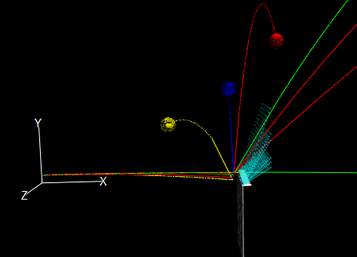

# Angle-Impact-simulator

 
[**Fig. 1:** The problem this simulator is trying to solve]

[**Fig. 2:** The simulator.]

This script shows how a ball reacts when colliding with an angle.

------------------------------------------------------------------------------------------------------------------------------------------

It uses the following libraries to display the animation:
- VPython
- Wx
- Numpy

Some results from the article: "Impact Behavior of a superball" were used in the script.
Link to this article: https://doi.org/10.1119/1.4898312
